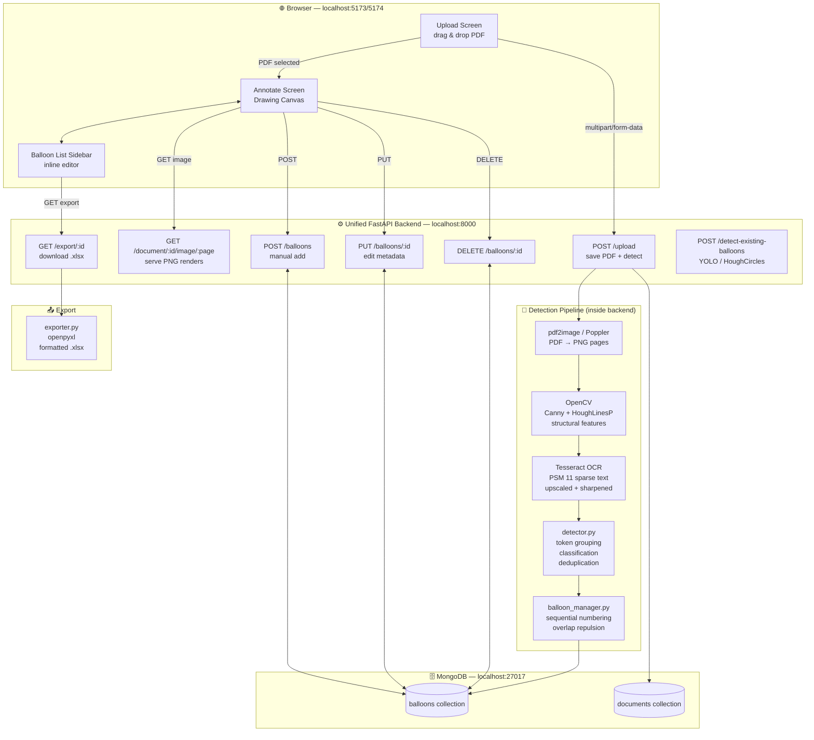
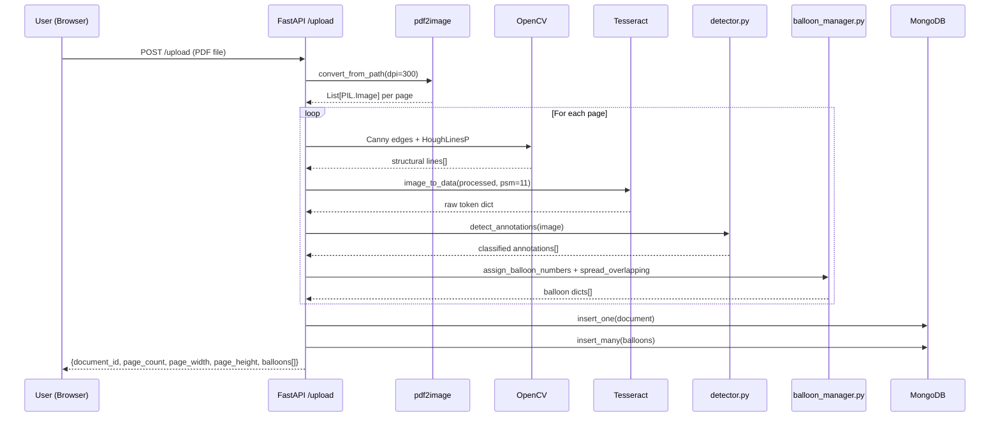
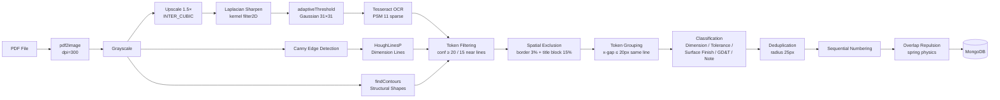

# CADLens — AI-Powered CAD Balloon Detection & Annotation

> Automatically detect, annotate, and export dimensional balloons from engineering PDF drawings using computer vision, OCR, and an interactive canvas editor.

---

## 🏗️ Architecture



---

## 🔄 Request Flow — PDF Upload



---

## 📂 Project Structure

```
CADProject-main/
│
├── .gitignore                      # Root gitignore (node_modules, venv, uploads, exports, *.pt)
├── README.md                       # This file
│
├── backend/                        # Unified FastAPI Python service
│   ├── main.py                     # App entry point — all HTTP routes
│   ├── detector.py                 # OpenCV + Tesseract annotation pipeline
│   ├── balloon_manager.py          # Sequential numbering + overlap repulsion physics
│   ├── exporter.py                 # openpyxl Excel generator (styled, auto-width columns)
│   ├── database.py                 # Motor async MongoDB client
│   ├── models.py                   # Pydantic request/response schemas
│   ├── requirements.txt            # Python dependencies
│   └── storage/
│       ├── uploads/                # Saved PDFs + rendered page PNGs (git-ignored)
│       └── exports/                # Generated .xlsx files (git-ignored)
│
├── frontend/                       # React + Vite SPA
│   ├── index.html
│   ├── vite.config.js
│   ├── package.json
│   └── src/
│       ├── main.jsx                # React entry point
│       ├── App.jsx                 # Root state machine — upload → annotate views
│       ├── App.css                 # Glassmorphism dark-mode design system
│       ├── index.css               # Base reset
│       └── components/
│           ├── DrawingCanvas.jsx   # HTML5 Canvas overlay — balloons + leader lines
│           ├── BalloonList.jsx     # Sidebar — per-type inline field editor
│           └── Toolbar.jsx         # Zoom controls, mode toggle, export, new upload
│
└── processing-service/             # Legacy standalone FastAPI (superseded by backend/)
    ├── main.py
    └── requirements.txt
```

---

## ⚙️ Detection Pipeline Detail



---

## 📋 Prerequisites

| Tool | Version | Install |
|------|---------|---------|
| Node.js | ≥ 18.0 | [nodejs.org](https://nodejs.org) |
| Python | 3.9 – 3.11 | [python.org](https://python.org) |
| MongoDB Community | ≥ 6.0 | `brew install mongodb-community` |
| Tesseract OCR | any | `brew install tesseract` |
| Poppler | any | `brew install poppler` |

---

## 🚀 Running Locally

You need **3 terminals** running simultaneously.

### Terminal 1 — MongoDB

```bash
brew services start mongodb-community
```

### Terminal 2 — FastAPI Backend

```bash
cd backend
pip install -r requirements.txt
uvicorn main:app --port 8000 --reload
```

Backend is live at → **http://localhost:8000**  
Interactive API docs → **http://localhost:8000/docs**

### Terminal 3 — React Frontend

```bash
cd frontend
npm install
npm run dev
```

Frontend is live at → **http://localhost:5173** *(or 5174 if 5173 is taken)*

> **Note:** `pip install` and `npm install` are only needed the first time.

---

## 🔌 API Reference

| Method | Endpoint | Description |
|--------|----------|-------------|
| `POST` | `/upload` | Upload a PDF — runs full detection pipeline |
| `GET` | `/document/{id}` | Fetch document metadata + all balloons |
| `GET` | `/document/{id}/image/{page}` | Serve rendered PNG for a page |
| `POST` | `/balloons` | Manually create a balloon |
| `PUT` | `/balloons/{id}` | Update balloon metadata (text, tolerances, etc.) |
| `DELETE` | `/balloons/{id}` | Delete a balloon |
| `GET` | `/export/{id}` | Download annotated balloon table as `.xlsx` |
| `POST` | `/detect-existing-balloons` | Re-run YOLO / HoughCircles on stored page images |

---

## 🧠 Annotation Types

| Type | Example text | Detection rule |
|------|-------------|----------------|
| **Dimension** | `39.5`, `Ø50`, `R12`, `H8` | Contains digit, Ø, R, H followed by number |
| **Tolerance** | `±0.05`, `+0.039 / -0.000`, `0.150` | ± symbol, leading decimal, +/- pair |
| **Surface Finish** | `Ra 1.6`, `Rz 6.3` | Ra / Rz / Rq / Rt keyword |
| **GD&T** | `⊙ 0.05 A`, `⊥ 0.1 A-B` | GD&T symbols or `0.xx LETTER` pattern |
| **Note** | `62 Nos.`, `C45 Steel` | 3+ meaningful chars, no other match |

---

## 📤 Excel Export Format

Each exported `.xlsx` contains one row per balloon with these columns:

| Balloon No. | Drawing Ref | Type | Nominal Value | Upper Tol. | Lower Tol. | Surface Finish | Process | Datum Ref | Tol. Zone | Qty | Material | Description | Page No. | Remarks |

- Blue header row (Calibri Bold)
- Alternating row shading
- Auto-sized columns (capped at 50 chars)

---

## 🗂️ Git Setup

```bash
# 1. Initialise repo
git init
git add .
git commit -m "feat: initial CADLens workspace"

# 2. Push to GitHub
git branch -M main
git remote add origin https://github.com/YOUR_USERNAME/CADLens.git
git push -u origin main
```

Files automatically excluded by `.gitignore`:
- `node_modules/`, `venv/`, `__pycache__/`
- `storage/uploads/` — uploaded PDFs
- `storage/exports/` — generated Excel files
- `*.pt`, `*.onnx` — YOLO model weights
- `.env`, `.DS_Store`

---

## 🛠️ Troubleshooting

| Problem | Fix |
|---------|-----|
| **Upload failed** | Check that the backend is running on port 8000 and MongoDB is started |
| **CORS error in browser** | Vite may have started on port 5174 instead of 5173 — both are allowed in `main.py` |
| **PDF conversion failed** | Run `brew install poppler` and restart terminal |
| **No balloons detected** | Ensure `brew install tesseract` succeeded and `tesseract --version` works |
| **MongoDB connection refused** | Run `brew services start mongodb-community` |
| **YOLO not loading** | `balloon_detector.pt` not found — system falls back to OpenCV HoughCircles automatically |
