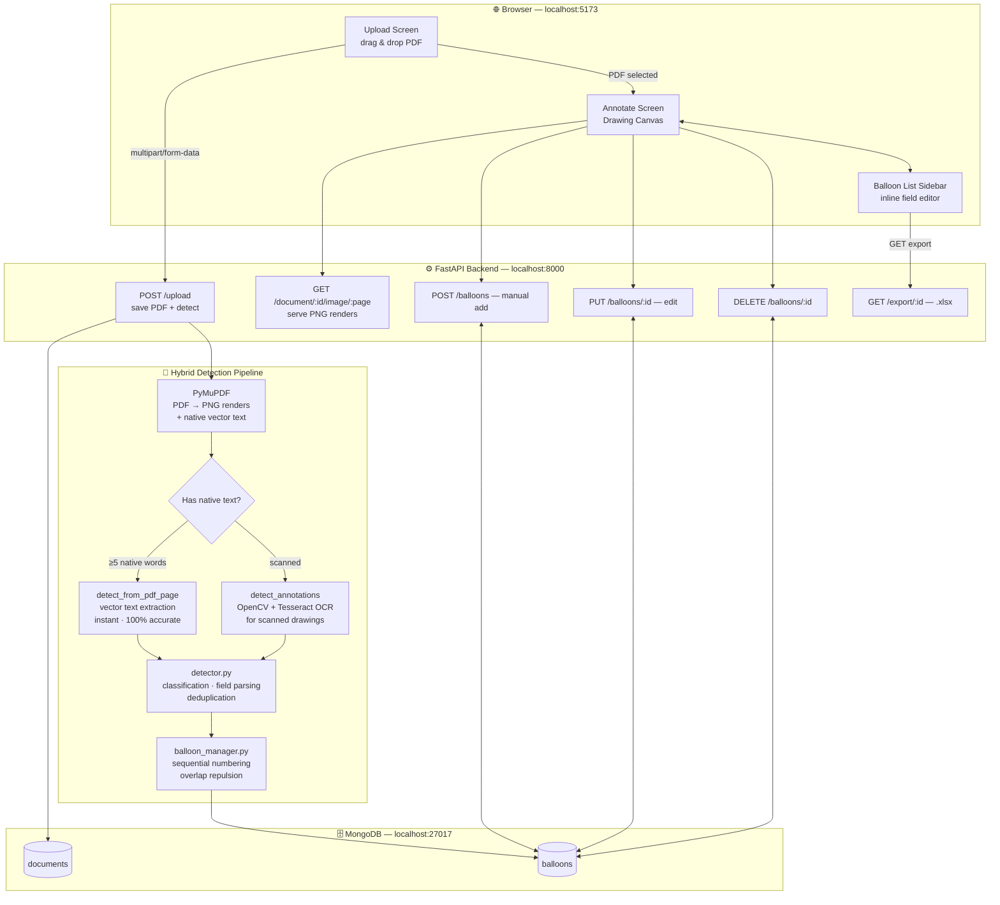
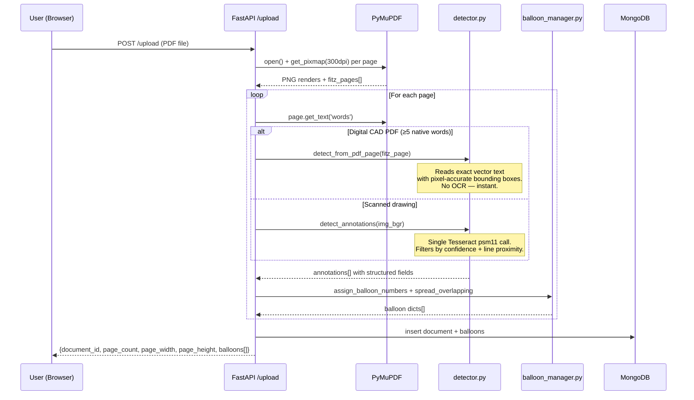

# CADLens — AI-Powered CAD Balloon Detection & Annotation

> Automatically detect, annotate, and export dimensional balloons from engineering PDF drawings using native PDF vector extraction, computer vision, and an interactive canvas editor.

[](https://python.org)
[](https://fastapi.tiangolo.com)
[](https://react.dev)
[](https://pymupdf.readthedocs.io)
[](https://mongodb.com)

---

## ✨ What it does

Upload any engineering drawing PDF and CADLens will:

1. **Detect** all dimension annotations, tolerances, surface finish callouts, and notes
2. **Number** each one with a sequential balloon (circled number with leader line)
3. **Populate** a structured sidebar with parsed fields — nominal value, upper/lower tolerance, surface finish, datum references, and more
4. **Export** a formatted Excel report (one row per balloon, all fields filled)
5. **Let you edit** — click any balloon to edit its data, drag balloons and leader line endpoints to reposition, manually add/delete balloons

**Performance:** < 1 second per page on digital CAD PDFs (AutoCAD, SolidWorks, CATIA, Creo). Scanned drawings fall back to a full-page OCR pipeline.

---

## 🏗️ Architecture



---

## 🔄 Request Flow — PDF Upload



---

## 📂 Project Structure

```
CADLens/
│
├── .gitignore                      # Excludes node_modules, venv, uploads, exports, *.pt
├── README.md                       # This file
│
├── backend/                        # Unified FastAPI Python service
│   ├── main.py                     # All HTTP routes + hybrid detection orchestration
│   ├── detector.py                 # Hybrid pipeline: native PDF extraction + OCR fallback
│   ├── balloon_manager.py          # Sequential numbering + overlap repulsion physics
│   ├── exporter.py                 # openpyxl Excel generator (styled, auto-width columns)
│   ├── database.py                 # Motor async MongoDB client
│   ├── models.py                   # Pydantic request/response schemas
│   ├── requirements.txt            # Python dependencies (pinned)
│   └── storage/
│       ├── uploads/                # Saved PDFs + rendered page PNGs (git-ignored)
│       └── exports/                # Generated .xlsx files (git-ignored)
│
├── frontend/                       # React + Vite SPA
│   ├── index.html
│   ├── vite.config.js
│   ├── package.json
│   ├── .env.example                # → copy to .env, set VITE_API_URL
│   └── src/
│       ├── main.jsx                # React entry point
│       ├── api.js                  # Centralized API base URL (import.meta.env.VITE_API_URL)
│       ├── App.jsx                 # Root state machine — upload → annotate views
│       ├── App.css                 # Glassmorphism dark-mode design system
│       └── components/
│           ├── DrawingCanvas.jsx   # Canvas overlay — balloons, leader lines, drag support
│           ├── BalloonList.jsx     # Sidebar — per-type field editor, styled confirm dialog
│           └── Toolbar.jsx         # Zoom, mode toggle, export, new upload
│
└── processing-service/             # Legacy standalone FastAPI (superseded, kept for reference)
```

---

## ⚙️ Detection Pipeline

```mermaid
flowchart LR
    PDF[PDF File] --> MU[PyMuPDF\nrender 300 DPI]
    MU --> CHK{Native words\n≥ 5?}

    CHK -->|YES\ndigital CAD PDF| VEC[detect_from_pdf_page\npage.get_text words]
    VEC --> EXCL1[Spatial Exclusion\n4% border + bottom 22%\ntitle block]
    EXCL1 --> CLS1[Strict Classification\n_DIM_PATTERNS regex\nengineering only]

    CHK -->|NO\nscanned drawing| GR[Grayscale]
    GR --> EDGES[Canny + HoughLinesP\ndimension lines]
    GR --> UP[Upscale 1.5×\nINTER_CUBIC]
    UP --> SHARP[Laplacian Sharpen]
    SHARP --> THRESH[adaptiveThreshold\nGaussian 31×31]
    THRESH --> TESS[Tesseract OCR\nPSM 11 — single call]
    TESS --> FILT[Token Filtering\nconf ≥ 40 hard floor\nconf ≥ 50 or near dim-line]
    FILT --> EXCL2[Spatial Exclusion\n4% border + bottom 22%]
    EXCL2 --> GROUP[Token Grouping\nsame line · x-gap ≤ 25px]
    GROUP --> CLS1

    CLS1 --> PARSE[_parse_annotation_fields\nnominal · tolerances\nsurface finish · datum]
    PARSE --> DEDUP[Deduplication\nradius 30px]
    DEDUP --> ASSIGN[Sequential Numbering\nmax balloon_no + 1]
    ASSIGN --> REPEL[Overlap Repulsion\nspring physics]
    REPEL --> MONGO[(MongoDB)]

    EDGES --> FILT
```



---

## 📋 Prerequisites

| Tool | Version | Install |
|------|---------|---------|
| Node.js | ≥ 18 | [nodejs.org](https://nodejs.org) |
| Python | 3.9 – 3.11 | [python.org](https://python.org) |
| MongoDB Community | ≥ 6.0 | `brew install mongodb-community` |
| Tesseract OCR | any | `brew install tesseract` *(only needed for scanned drawings)* |
| PyMuPDF | 1.28.2 | installed via `pip install -r requirements.txt` |

> **Note:** Poppler is no longer required — PDF rendering is done entirely by PyMuPDF.

---

## 🚀 Running Locally

You need **3 terminals** running simultaneously.

### Terminal 1 — MongoDB

```bash
brew services start mongodb-community
```

### Terminal 2 — FastAPI Backend

```bash
cd backend
pip install -r requirements.txt
uvicorn main:app --port 8000 --reload
```

Backend is live at → **http://localhost:8000**
Interactive API docs → **http://localhost:8000/docs**

### Terminal 3 — React Frontend

```bash
cd frontend
cp .env.example .env          # first time only
npm install                   # first time only
npm run dev
```

Frontend is live at → **http://localhost:5173**

> `pip install` and `npm install` are only needed the first time or after dependency changes.

---

## 🔌 API Reference

| Method | Endpoint | Description |
|--------|----------|-------------|
| `POST` | `/upload` | Upload a PDF — runs full hybrid detection pipeline |
| `GET` | `/document/{id}` | Fetch document metadata + all balloons |
| `GET` | `/document/{id}/image/{page}` | Serve rendered PNG for a page |
| `POST` | `/balloons` | Manually create a balloon at a canvas position |
| `PUT` | `/balloons/{id}` | Update balloon position, text, tolerances, etc. |
| `DELETE` | `/balloons/{id}` | Delete a balloon |
| `GET` | `/export/{id}` | Download annotated balloon table as `.xlsx` |
| `POST` | `/detect-existing-balloons` | Re-run YOLO / HoughCircles on stored page images |

---

## 🧠 Annotation Types & Classification

| Type | Example text | Detection rule |
|------|-------------|----------------|
| **Dimension** | `39.5`, `Ø50`, `R12`, `M10x1.5`, `H8`, `45°` | Engineering prefix/suffix — Ø, R, M, H, °, mm, or decimal |
| **Tolerance** | `±0.05`, `+0.039/-0.000`, `0.150` | ± symbol, leading decimal, +x/−y pair |
| **Surface Finish** | `Ra 1.6`, `Rz 6.3` | Ra / Rz / Rq / Rt keyword |
| **GD&T** | `⊙ 0.05 A`, `⊥ 0.1 A-B` | GD&T Unicode symbols or `0.xx LETTER` pattern |
| **Note** | `42CrMo4`, `62 Nos.` | 3+ meaningful chars not matching the above |

**Deliberately rejected** (not ballooned):
- Single letters (`A`, `B`, `C`) — section/datum markers
- Single digits (`1`–`9`) — border grid references
- Title block keywords (`DRAWN BY`, `MATERIAL`, `CUSTOMER`, `ALL DIMENSIONS`, …)
- Section labels (`VIEW C`, `SECTION A-A`)

---

## 📤 Excel Export Format

Each exported `.xlsx` contains one row per balloon with auto-populated columns:

| Balloon No. | Drawing Ref | Type | Nominal Value | Upper Tol. | Lower Tol. | Surface Finish | Process | Datum Ref | Tol. Zone | Qty | Material | Description | Page No. | Remarks |
|---|---|---|---|---|---|---|---|---|---|---|---|---|---|---|

- Blue header row (Calibri Bold 11pt)
- Alternating row shading
- Auto-sized columns (max 50 chars)
- Fields auto-populated from detection — no manual entry required for standard dimensions

---

## 🖱️ Using the Canvas

| Action | How |
|--------|-----|
| **Auto-detect** | Upload a PDF — balloons appear automatically |
| **Inspect Balloon** | Click any balloon circle on canvas → automatically highlights, scrolls, and expands its details in the sidebar |
| **Select Row** | Click any sidebar row → highlights the corresponding balloon on the canvas |
| **Edit fields** | Expand a balloon row → edit inline fields, press Enter or click away to save |
| **Move balloon** | Click and drag any balloon circle — leader line remains pinned to the measured CAD feature |
| **Move leader endpoint** | Select a balloon, then drag the yellow feature dot to point to a new CAD feature |
| **Add balloon** | Switch to **Manual** mode (toolbar), click on the drawing |
| **Delete balloon** | Click the trash icon → confirm in the styled dialog |
| **Change type** | Expand balloon → change Type dropdown |
| **Export** | Click **Export XLSX** in the toolbar |

---

## 🛠️ Troubleshooting

| Problem | Fix |
|---------|-----|
| **0 balloons detected** | Check backend logs — if `native PDF extraction` appears, the drawing has vector text. If `OCR fallback` appears, ensure `tesseract --version` works. |
| **Upload failed / CORS error** | Ensure the backend is running on port 8000 and MongoDB is started |
| **PDF conversion failed** | PyMuPDF handles this now — run `pip install PyMuPDF==1.28.2` |
| **MongoDB connection refused** | Run `brew services start mongodb-community` |
| **YOLO not loading** | `balloon_detector.pt` not found — system auto-falls back to OpenCV HoughCircles |
| **Balloons on wrong page area** | Check that `TITLE_BLOCK_FRAC` in `detector.py` matches your drawing's layout (default 78%) |
| **Sidebar fields empty** | After re-uploading with the new code, fields auto-populate. Old documents in MongoDB predate structured parsing — delete and re-upload. |

---

## 🗂️ Git Setup

```bash
# Clone
git clone https://github.com/vidhan13i/CADLens.git
cd CADLens

# Backend
cd backend && pip install -r requirements.txt

# Frontend
cd ../frontend && cp .env.example .env && npm install
```

Files automatically excluded by `.gitignore`:
- `node_modules/`, `venv/`, `__pycache__/`
- `backend/storage/uploads/` — uploaded PDFs + rendered PNGs
- `backend/storage/exports/` — generated Excel files
- `*.pt`, `*.onnx` — YOLO model weights (download separately)
- `.env` — local environment variables (copy from `.env.example`)
- `.DS_Store`

---

## 📈 Changelog

### v2.1 — Interactive Ballooning & CAD Precision Tolerancing *(Latest)*

| Feature / Area | Before (Previous Implementation) | Updated Code | How It Is Improved |
| :--- | :--- | :--- | :--- |
| **Interactive Canvas Click** | Clicking a balloon on the canvas had no inspector response; user had to hunt through the sidebar. | Added two-way sync: `onBalloonClick` triggers `selectedBalloonId`, auto-expands row and smooth-scrolls into view. | Instantly view and inspect any balloon's full 11-field data sheet with a single click on the drawing. |
| **Balloon Drag & Leader Line** | Dragging a balloon moved both the badge `(x, y)` and the feature point `(feature_x, feature_y)`, detaching from the target. | Leader line anchor `(feature_x, feature_y)` stays firmly pinned to the CAD feature when moving the badge. | Keeps the pointer anchored to the exact dimension while freely decluttering badge positions. |
| **Canvas Drag State Management** | `mouseup` listener was attached only to `<canvas>`; dragging outside canvas caused balloons to stick to cursor. | Moved mouse listeners to window level with proper cleanup on unmount. | Smooth drag-and-drop experience that never gets stuck, even on rapid mouse movements. |
| **Stacked Bilateral Tolerances** | Multi-line stacked tolerances (e.g. `+0.039` over `0.000`) were split into separate fragments or dropped signs. | Implemented Y-proximity clustering in `_extract_stacked_tolerances` to correctly associate upper and lower limits. | Accurately extracts upper (`+0.039`) and lower (`+0.000`) tolerances into distinct fields for FAI compliance. |
| **Chamfer & Degree Symbol Parsing** | MacRoman/Windows-1252 degree symbol `\x83` (`ƒ`) was unhandled; chamfers like `1x45°` were marked as "Notes" with empty nominals. | Added `_DEGREE_FIXUP` dictionary and normalization in `detector.py`. | Chamfers like `1x45°` are correctly classified as **Dimension**, nominal: `1x45°`, process: `CHAMFER`. |
| **ISO Fit Classification** | Early returns in `_parse_annotation_fields` bypassed ISO fits (`H8`, `H11`, `H12`) or lumped them into nominal text. | Extracted ISO fits into dedicated `tolerance_zone` attribute and prevented premature exit in the parser. | Fit grades are cleanly categorized and exported to the dedicated Tolerance Zone column in Excel. |
| **Inspection Data Export** | Missing tolerance bounds and fit classifications in exported reports. | Full export integration for nominal values, upper/lower tolerances, ISO fits, and machining processes. | Produces professional, audit-ready Excel reports for Quality Control and First Article Inspection. |

---

### v2.0 — Hybrid Detection Engine *(Oct 2026)*

**Detection overhaul — 0 → 61 balloons on a real A3 engineering drawing:**

- **Native PDF extraction** (`detect_from_pdf_page`) as primary path — reads exact vector text from digital CAD PDFs in < 1 second. No OCR errors, no confidence thresholds, no image processing overhead.
- **Improved OCR fallback** for scanned drawings — single full-page Tesseract call (was: one call per contour, 500+ OS processes, 31 seconds per page).
- **Strict classification** — `_DIM_PATTERNS` regex requires engineering prefixes (Ø, R, M, H, °, mm, decimal). Was: any text containing a single digit was classified as a Dimension.
- **Title block exclusion** fixed — was disabled for landscape drawings (all CAD drawings are landscape). Now 78% cutoff for all orientations.
- **Confidence thresholds** raised — hard floor 40 (was 15), pass threshold 50 (was 45). Eliminates OCR hallucinations on dimension lines and hatching.
- **Structured field parsing** (`_parse_annotation_fields`) — `nominal_value`, `tolerance_upper`, `tolerance_lower`, `surface_finish`, `datum_ref`, `tolerance_zone`, `quantity`, `material` are now auto-populated in MongoDB, the sidebar editor, and Excel export.

**Bug fixes:**
- `import pymupdf` replaces deprecated `import fitz`
- RGBA 4-channel PDF renders no longer crash `cv2.COLOR_BGR2GRAY`
- YOLO balloon coordinates were scaled to a 1000px thumbnail — now use native image coordinates
- Manual balloon add used `count+1` (collides after delete) — now uses `max(balloon_no)+1`
- Sidebar `DetailField` showed stale data when switching between balloons — `useEffect` sync added

**Frontend:**
- Balloon drag & drop — move the balloon body or the leader line endpoint
- Styled in-app confirmation dialog replaces blocking `window.confirm()`
- Centralized API URL in `src/api.js` (was hardcoded in 4 separate files)
- `frontend/.env.example` template added for new contributors

---

*Built with FastAPI · PyMuPDF · OpenCV · Tesseract · React · MongoDB · openpyxl*

